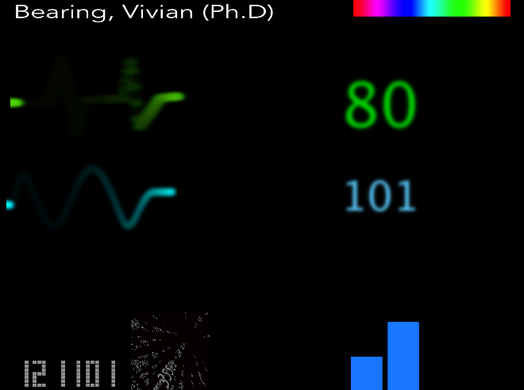

# README

Concept version, prototyped for an onstage "medical monitor" display to match character state. Designed to be run from a Korg nanoKONTROL2 with TouchOSC and Lemur templates included. Target monitor resolution either 640x480 or 800x600.

## MIDI Map (channel 16):

### Green blip/numbers:

- Enable: cc32
- Animate: cc64
- Frequency: cc0
- Flatline: cc48
- Trace amount: cc16

### Blue blip/numbers: 

- Enable: cc33
- Animate: cc65
- Frequency: cc1
- Flatline: cc49
- Trace amount: cc17

### Blue/Red bars:

- Enable: cc34
- Amplitude: cc18
- Frequency: cc2
- Toggle blue/red: cc66

### Other elements:

- Blank screen: cc46
- Matrix enable: cc35
- Matrix speed: cc3
- Widgets enable: cc51
- Infos enable: cc67

## Third Party Modules
Several elements were created by others and modified by me where necessary.

- [ManySpriteClock](http://www.quartzcompositions.com/phpBB2/upload/details.php?file=9908)
- [NumWorld](http://vimeo.com/5693158)
- [Audio-Reactive Spectrum](source needed)
- [Color Matrix](source needed)
- M8 Blur effect: [Hybrid Visuals](http://www.hybridvisuals.nl) and [Memo](http://www.memo.tv)
